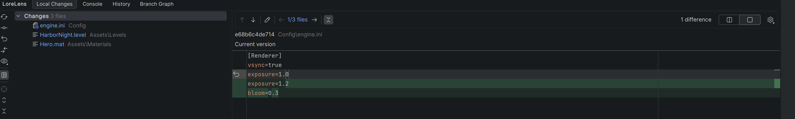
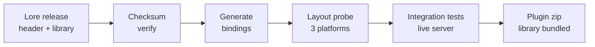

<!-- markdownlint-disable MD033 MD041 -->
<div align="center">

<picture>
  <source media="(prefers-color-scheme: dark)" srcset="docs/readme/Lore_White_V1.svg">
  
</picture>

<h1>LoreLens</h1>

<p><strong>Community-made plugin. Not affiliated with or endorsed by Epic Games. Lore is a trademark of Epic Games, Inc.</strong></p>

<p>Lore version control in your JetBrains IDE, inspired by GitLens.</p>

<p>
  <a href="https://plugins.jetbrains.com/plugin/33434-lorelens">Marketplace</a>
  &nbsp;&middot;&nbsp;
  <a href="https://lore.org">Get Lore</a>
  &nbsp;&middot;&nbsp;
  <a href="https://lore.org">Lore docs</a>
  &nbsp;&middot;&nbsp;
  <a href="https://github.com/dzmitryj/lorelens/releases">Releases</a>
</p>

<p>
  <a href="https://plugins.jetbrains.com/plugin/33434-lorelens"></a>
  <a href="https://plugins.jetbrains.com/plugin/33434-lorelens"></a>
  <a href="https://github.com/dzmitryj/lorelens/actions/workflows/build.yml"></a>
  <a href="https://lore.org"></a>
  <a href="LICENSE"></a>
</p>

<br>

<p></p>

</div>

LoreLens is a JetBrains IDE plugin for [Lore](https://lore.org), Epic Games' open-source version
control system for repositories that mix source code with large binary assets. It takes its cue from
[GitLens](https://www.gitkraken.com/gitlens): the history, blame, branches, and merges belong where
you already work, not behind a command line. One lane and colour per branch, blame on the caret line,
and every revision, merge, and lock a click away.

Lore is centralized and built for game-sized trees, where binary assets are locked instead of merged
and a status check cannot afford to scan the whole repository. LoreLens brings that into the IDE: a
branch graph you can read at a glance, blame under your caret, and every revision, merge, and lock a
click away.

## Features

**See the repository**

- **Branch Graph:** the whole repository as swimlanes, one lane and colour per branch, merges drawn
  rather than inferred. Drag to pan, wheel to zoom, right-click a lane to switch or merge.
- **History:** the checked-out branch's ancestry, with work merged in from other branches kept in its
  own colour, unsynced revisions marked, and a ring on the revision you are on.
- **Blame:** inline on the caret line, traced to the revision that last touched it.

**Work the repository**

- **Commit** with push-after-commit on by default, plus revert, staging, and shelve.
- **Merge** in either direction, with a preview first and conflict resolution as mine or theirs, restore
  markers, abort, or restart. The same machinery drives revert.
- **Branches** created and switched from the graph, with renames tracked through Lore's moves rather
  than reported as an add plus a delete.

**Built for assets**

- **Locks:** editing a read-only asset takes its lock, files held by someone else stay read-only with a
  banner naming the holder, and a status bar widget shows what you hold.
- **Instant status:** a live Changes view with gutter markers that stays accurate as you edit, with no
  filesystem walk.
- **The rest:** clone with a view filter, historical content fetched by address, `.loreignore`
  highlighting, and a console of every Lore operation.

<div align="center">

<p></p>
<p><sub>Branch Graph: the repository as swimlanes, a release stabilised and hotfixed on its own branch</sub></p>

<p></p>
<p><sub>Local Changes: code and cooked assets staged and diffed side by side</sub></p>

<p></p>
<p><sub>Blame: each line traced to the revision that last touched it</sub></p>

</div>

## Compatibility

LoreLens loads Lore's shared library into the IDE process and calls its C API through generated
bindings. There is no CLI and no subprocess. A status query is a function call and returns in
microseconds. The cost is strict: the plugin is bound to the library's exact ABI, and ABI mistakes do
not fail. If the bindings are wrong about where one struct field sits, the read succeeds and returns
the neighbouring field's bytes. Lore itself is pre-1.0 and moves quickly; one six-week stretch added
24 exported symbols and renumbered the error codes. The compatibility model is built around those two
facts.

### One version, pinned

Every build targets exactly one Lore release and runs the same pipeline:



The build downloads the pinned release's C header and shared library, verifies both against checksums
committed in the tree, and bundles the library into the plugin zip. Binaries never enter version
control; the checksums do. The bindings are generated from the header and checked in as source, 265
functions and 424 struct layouts at the current pin. Moving to a new Lore is therefore an ordinary
diff: which functions arrived, which structs changed shape, which error codes moved. It is reviewed
like handwritten code, because someone will debug through it like handwritten code.

### Struct layout is the hard part

The generator reads each struct in the header and derives a memory layout from field types and C ABI
rules. This is the layout the plugin trusts on every call:

```kotlin
object lore_global_args_t {
    const val SIZE: Long = 136L
    const val ALIGNMENT: Long = 8L

    val LAYOUT: StructLayout = MemoryLayout.structLayout(
        lore_string_t.LAYOUT.withName("repository_path"),
        lore_string_t.LAYOUT.withName("working_directory"),
        lore_string_t.LAYOUT.withName("correlation_id"),
        lore_string_t.LAYOUT.withName("identity"),
        ValueLayout.JAVA_BYTE.withName("force"),
        // ...
```

An inference like this can be wrong, and a wrong one still compiles, links, and runs. Padding rules,
nested structs, and unions all leave room for a bad guess that only shows up as garbage data. So the
generator also emits a C program that includes the real Lore header and re-derives every number with
the compiler itself:

```c
/* Generated from lore.h 0.8.6 by :codegen. Do not edit. */
check("lore_address_t sizeof",   sizeof(lore_address_t),            48);
check("lore_address_t alignof",  _Alignof(lore_address_t),           1);
check("lore_address_t.hash",     offsetof(lore_address_t, hash),     0);
check("lore_address_t.context",  offsetof(lore_address_t, context), 32);
```

The probe makes 2,077 such checks, one for the size, alignment, and every field offset of every struct
the plugin touches. CI compiles and runs it on Windows, Linux, and macOS. If the compiler disagrees
with the bindings anywhere, the build fails on that platform. A layout bug cannot reach a user's
machine without first failing a build.

### The rest of the contract

Layout is necessary, not sufficient. Three more checks close the gap:

- Exported functions are resolved when the library loads. A symbol that disappeared fails at startup
  and names itself, instead of crashing mid-operation on first use.
- The library reports its version at load, and the plugin refuses a mismatch outright. A wrong pairing
  would otherwise surface later, as a layout bug with none of the context.
- Integration tests start a real Lore server on loopback and drive real repositories through the
  workflows the plugin ships: commit, merge, conflict resolution, locks, sync, history. When Lore
  changes behaviour between releases rather than layout, a test fails instead of a user.

### Following Lore

A scheduled job watches for new Lore releases. It re-pins, regenerates the bindings, and opens a pull
request whose body is the ABI diff: symbols added, symbols removed, error codes changed, with the probe
and the test suite already run against the new release, and a breaking label when anything was removed.
Adopting a new Lore is reviewing that change. The plugin version records the result, the Lore version a
build targets plus the plugin's own revision, and the runtime requirement is one line: run against a
server on the Lore version the build names.

Bundled for Windows x64, Linux x64 and arm64, and macOS arm64; Epic ships no macOS x64 build, so Intel
Macs are unsupported. Needs a JetBrains IDE on platform 2026.1 or later (build 261).

## Install

### 1. Install the plugin

Install [LoreLens from the JetBrains Marketplace](https://plugins.jetbrains.com/plugin/33434-lorelens):
**Settings → Plugins → Marketplace**, search for `LoreLens`. Or grab `LoreLens-<version>.zip` from
[Releases](https://github.com/dzmitryj/lorelens/releases) and use
**Settings → Plugins → ⚙ → Install Plugin from Disk**. Either way the Lore library ships inside the
plugin; there is nothing else to install on the client.

You also need a Lore server to talk to. Lore is centralized, and `loreserver` runs with zero
configuration if you need your own.

### 2. Open a Lore repository

Open any project inside a Lore working directory. A working directory is one that contains a `.lore`
folder with an `instance` file inside it, which is what a clone or a Create Lore Repository leaves
behind. LoreLens detects it on project open and registers the root automatically; the status bar shows
the branch and revision, and the Local Changes, History, and Branch Graph tabs appear in the Version
Control tool window.

Detection deliberately checks for `.lore/instance`, not just the `.lore` folder, so a leftover or
half-deleted `.lore` directory does not map as a repository.

No repository yet? **VCS → Create Lore Repository** turns the current project into one, and
**File → New → Project from Version Control** clones an existing one, with an optional view filter for
partial checkouts.

### 3. If the mapping does not appear

Detection can be declined in the moment or switched off by IDE settings, and a repository root that
sits above the project root is easy to miss. The mapping is plain IDE configuration, set by hand in
**Settings → Version Control → Directory Mappings**:

1. Remove any `<Project>` mapping pointing at the wrong VCS.
2. Add a mapping, set the directory to the folder containing `.lore` (the working directory root, which
   may be a parent of the project), and set the VCS to **LoreLens**.
3. Apply. If the tabs still do not appear, confirm `.lore/instance` exists in the mapped directory; a
   directory without it is not a valid checkout.

One mapping per working directory is enough; everything beneath it is covered.

## Building

```bash
./gradlew buildPlugin                     # build the distributable zip
./gradlew check                           # tests, against a real loreserver on loopback
./gradlew :codegen:generateLoreBindings   # regenerate the Lore bindings
```

The [demo repository](docs/dev/screenshots.md) behind the screenshots is seeded and captured by the
tooling in `docs/dev`.

## License

[MIT](LICENSE). The bundled Lore shared library is MIT licensed by Epic Games, and its license and
third-party notices ship inside the plugin's `native` directory. The Lore name and logo are trademarks
of Epic Games, Inc., used here for identification. LoreLens is an independent project, not affiliated
with or endorsed by Epic Games.
