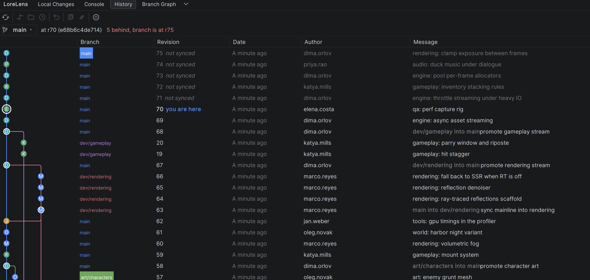
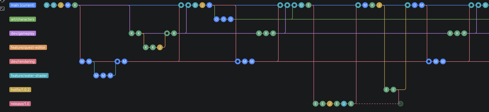
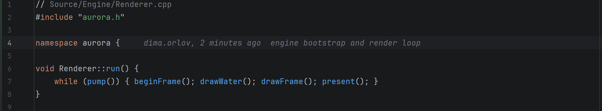

<div align="center">


Lore inside JetBrains IDEs — status without scanning, locks, and a graph per branch.

[](https://github.com/dzmitryj/lore-version-control/actions/workflows/build.yml)
[](https://lore.org)
[](LICENSE)



</div>

[Lore](https://lore.org) is Epic Games' open-source version control system for repositories that mix
source code with large binary assets. LoreLens binds its C library in-process through `java.lang.foreign` —
no CLI, no subprocesses — and feeds it what the IDE already knows: which files you touched, the moment you
touch them. Lore's status never walks the tree, so the Changes view stays instant on a repository where a
scan costs minutes.

> Not affiliated with or endorsed by Epic Games. Bundles the Lore shared library (MIT).

## What you get

**A graph that tells the truth.** History shows the current branch's ancestry — one lane and one colour per
branch, everywhere in the plugin. A merge's edge runs down the lane of the branch that was merged, so
direction is the picture, not the commit message. Unsynced revisions are marked; a white ring says
*you are here*.

**Branches as swimlanes.** The Branch Graph lays the whole repository out left to right. Drag to pan, wheel
to zoom, right-click a lane to switch or merge — into the current branch, or the current branch onto the
target.

<div align="center"></div>

**The whole merge surface.** Preview before merging, resolve conflicts as mine or theirs, put the conflict
markers back after a wrong resolve, abort — and the same machinery drives reverting any revision.

**Locks, because assets don't merge.** Editing a read-only file acquires its lock. Files held by someone
else stay read-only, with a banner naming the holder. The status bar shows branch, revision, and locks held.

<div align="center"></div>

**And the rest.** Inline blame on the caret line. File history that follows renames exactly — Lore records
moves, nothing is inferred. Historical content fetched by content address, so diffs stay correct across
moves and deletes. Clone with a view filter. `.loreignore` highlighting. A console that records every Lore
operation, with optional native debug logging.

## Install

Until the Marketplace listing is live: grab `LoreLens-<version>.zip` from
[Releases](https://github.com/dzmitryj/lore-version-control/releases), then
**Settings → Plugins → ⚙ → Install Plugin from Disk**.

Requirements:

- A JetBrains IDE on platform **2026.1+** (build 261) — the first line where `java.lang.foreign` leaves preview.
- A Lore server. Lore is centralized; `loreserver` runs with zero configuration if you need your own.

The Lore library is bundled for Windows x64, Linux x64/arm64, and macOS arm64. Epic publishes no macOS x64
build, so Intel Macs are out.

## Versioning

`<lore version>.<plugin revision>` — `0.8.6.1` bundles liblore v0.8.6. The last number is the plugin's own
counter and resets when the Lore version moves.

## Development

```bash
./gradlew buildPlugin
```

`liblore` and `lore.h` are downloaded from the pinned release tag, checksum-verified against
`native/lore-versions.json`, and bundled at package time. Binaries are never committed.

The FFM bindings in `src/main/kotlin/com/dzmitryj/lorelens/ffi/generated` are generated from `lore.h` and
checked in, so their diffs are reviewable when Lore changes:

```bash
./gradlew :codegen:generateLoreBindings
```

Generated struct layouts are inferred from field types, and a wrong guess is not an error — it is a silently
wrong read. A generated C probe checks `sizeof`, `_Alignof` and `offsetof` for every struct against the real
compiler; CI runs it on all three platforms. `.github/workflows/upstream.yml` watches for new Lore releases
and opens a pull request carrying the ABI diff.

### Tests

```bash
./gradlew check
```

Integration tests start a real `loreserver` on loopback and drive real repositories — no external server,
no mocks of the library under test. They skip on platforms Lore publishes no server for.

### Verifying against the oldest supported IDE

The plugin compiles against 2026.2 but declares `sinceBuild = 261`; check an installed IDE at the low end
before releasing:

```bash
./gradlew verifyPlugin -PverifyAgainstIde="C:\Users\you\AppData\Local\Programs\Rider"
```

### Publishing

The first version is uploaded manually through the Marketplace web UI and passes human moderation;
`publishPlugin` works from the second version on. After that, `release.yml` signs and publishes on a GitHub
release using the `PUBLISH_TOKEN`, `CERTIFICATE_CHAIN`, `PRIVATE_KEY` and `PRIVATE_KEY_PASSWORD` secrets.

Verify signing locally first — the private key must be PKCS#8; a PKCS#1 key fails with an unhelpful error:

```bash
./gradlew signPlugin
```
